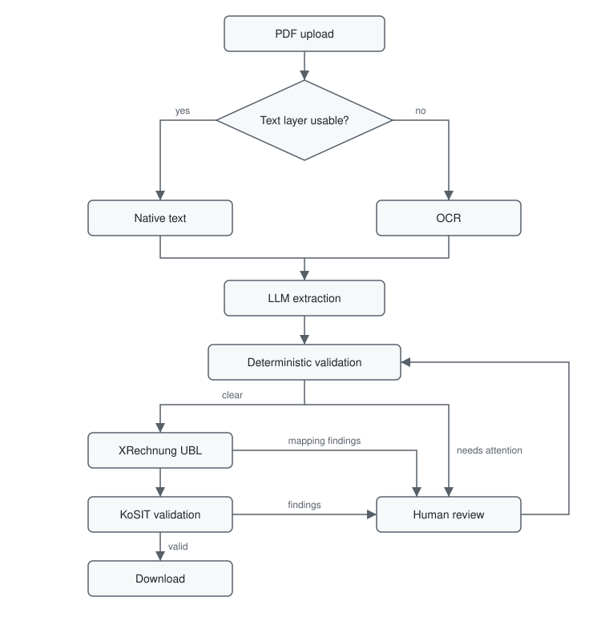
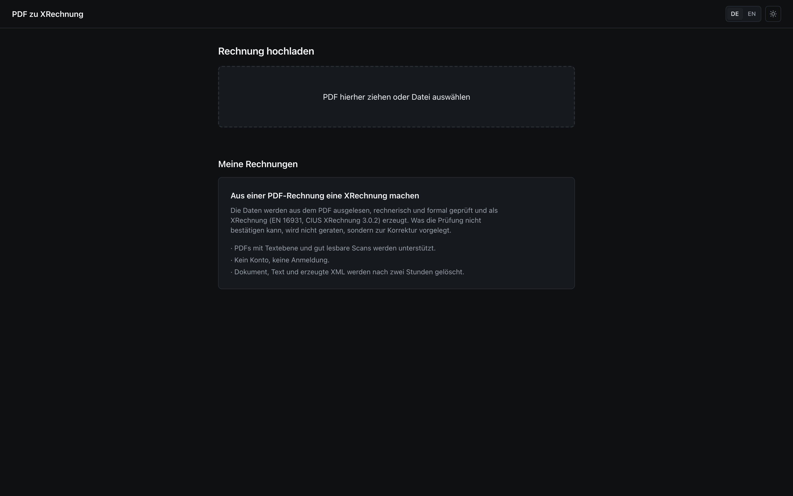
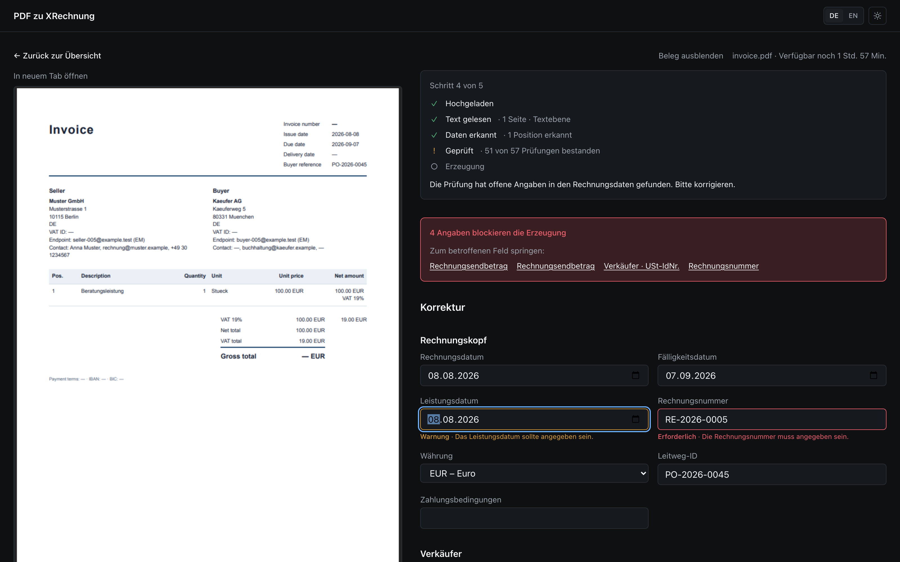
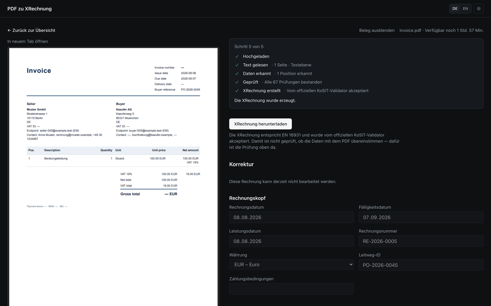

# PDF zu XRechnung

[](https://github.com/serhiibublyk88/pdf-to-xrechnung/actions/workflows/ci.yml)
[](LICENSE)

Turn a PDF invoice into XRechnung UBL through a reviewable pipeline: native text or OCR,
structured LLM extraction, deterministic business checks, human correction, XML generation,
and validation with KoSIT.

This full-stack portfolio project focuses on a difficult part of invoice conversion:
building a reliable workflow around imperfect PDFs and model output. It covers durable
state, retries, concurrent work, exact decimal arithmetic, clear failure states, and
measured extraction quality.

## What is implemented

- PDF upload, native-text extraction, and bounded Tesseract OCR fallback
- Gemini, Groq, and local Ollama providers behind one validated extraction contract
- 65 deterministic rules covering totals, VAT, identifiers, required fields, and plausibility
- German and English review UI with the source PDF beside the editable data
- XRechnung 3.0.2 UBL generation and real KoSIT validation before download
- PostgreSQL-backed lifecycle state, BullMQ retries, dead-letter recovery, deduplication,
  stale-job protection, and a two-hour access window followed by periodic cleanup
- Synthetic native-text and OCR evals with committed real-provider reports

<picture>
  <source media="(prefers-color-scheme: dark)" srcset="docs/images/pipeline-dark.svg">
  
</picture>

PostgreSQL is authoritative for every invoice transition. Redis carries recoverable jobs;
invoice state remains in PostgreSQL. Each job carries both the invoice ID and its current
`storageKey`, so work left behind by an expired upload cannot mutate a reused row.

## What it looks like

The upload view, the review workspace with the source PDF beside the extracted data, and a
document the KoSIT validator accepted. Captured from the running application on the
synthetic fixture `apps/api/evals/dataset/005-missing-fields-de` with the local Ollama
provider.



The source omits three mandatory values. They produce four blocking findings, so generation
stops for human review.



After the corrections the invoice passed all 67 checks, and KoSIT accepted the generated
XRechnung.



## Run it locally

Requirements: Docker with Compose and enough memory for PostgreSQL, Redis, the API, the
Next.js application, and the KoSIT validator.

```bash
cp apps/api/.env.example .env
docker compose up -d --build
```

Open [http://localhost:3000](http://localhost:3000). The API readiness endpoint is
[http://localhost:3001/health/ready](http://localhost:3001/health/ready).

The checked-in default is `LLM_PROVIDER=mock`, so the stack starts without a key. That
provider returns one fixed synthetic invoice regardless of the uploaded PDF. It is useful
for walking through review, validation, KoSIT, and download, but it does not demonstrate
PDF extraction.

For a real invoice, change `LLM_PROVIDER` in `.env` to `ollama`, `gemini`, or `groq` and
configure the matching values from [`apps/api/.env.example`](apps/api/.env.example). When
Ollama runs on the Docker host, use an address the API container can reach, such as
`http://host.docker.internal:11434` on Docker Desktop.

Gemini and Groq receive the extracted invoice text over their external APIs. Ollama keeps
that model call local. Check provider data-processing terms before using sensitive
documents.

## Measured extraction quality

The 18 committed fixtures include 13 native-text PDFs and five image-only PDFs. Three cases
are intended refusals. Ollama, Gemini, and Groq each ran the complete application pipeline
over that corpus with no mock provider: all three extracted every critical field, passed
every generated document through KoSIT, and produced no false success. The per-provider
table, the dated reports, and the individual mismatches are in
[`docs/evals.md`](docs/evals.md).

These are synthetic-fixture results, not a claim about arbitrary invoices. The scans are
cleaner than many real scans, the sample is small, and valid invoices still required review:
two with Ollama and Gemini, three with Groq.

## Verification

The repository separates pure logic, real infrastructure, and browser behaviour:

```bash
cp apps/api/.env.example .env
cp apps/api/.env.example apps/api/.env
docker compose up -d postgres redis kosit-validator
npm ci
(cd apps/api && npx prisma generate && npx prisma migrate deploy)
npm run lint
npm run typecheck
npm test
npm run test:integration
npm run test:e2e
npm run eval:validate
npm run build
```

`npm run test:e2e` runs the API suites against the real services. The Playwright browser
suite and host development are described in
[`docs/operations.md`](docs/operations.md#host-development). Live-provider evals are manual
because they consume external quota and are not deterministic.

## Product boundary

The intended user is an invoice issuer importing their own PDF or draft and issuing the
reviewed XRechnung. Converting a PDF received from someone else does not retroactively turn
the sender's original document into an issued e-invoice. This repository is an engineering
project, not legal advice.

The application does not include accounts, multi-tenancy, billing, ERP integration,
ZUGFeRD output, or a hosted instance. Local file storage and anonymous signed sessions are
appropriate for this portfolio project, but not sufficient for a production deployment.

Germany's current B2B transition and the distinction between an e-invoice and a plain PDF
are described in the [Federal Ministry of Finance FAQ](https://www.bundesfinanzministerium.de/Content/DE/FAQ/e-rechnung.html).
XRechnung is a German CIUS of EN 16931; the
[federal XRechnung guidance](https://e-rechnung-bund.de/faq/welcher-standard-ist-fur-die-rechnungsstellung-an-den-bund-zu-verwenden/)
explains its use for federal invoicing.

## Documentation

- [`docs/PROJECT.md`](docs/PROJECT.md): product scope, guarantees, and limitations
- [`docs/architecture.md`](docs/architecture.md): runtime design and recovery semantics
- [`docs/api-contract.md`](docs/api-contract.md): HTTP contract and validation vocabulary
- [`docs/extraction.md`](docs/extraction.md): PDF, OCR, provider, and schema boundaries
- [`docs/validation.md`](docs/validation.md): deterministic rule catalogue
- [`docs/generation.md`](docs/generation.md): UBL mapping and KoSIT boundary
- [`docs/operations.md`](docs/operations.md): running the local stack, configuration, and CI
- [`docs/evals.md`](docs/evals.md): dataset, metrics, and full provider results
- [`docs/architecture-decisions.md`](docs/architecture-decisions.md): accepted trade-offs
- [`docs/roadmap.md`](docs/roadmap.md): current status and follow-ups

## Contact

Questions, feedback, or collaboration ideas are welcome. Open an issue or reach me on
[LinkedIn](https://www.linkedin.com/in/serhii-bublyk-b720532a7/).

## License

MIT, see [`LICENSE`](LICENSE).
